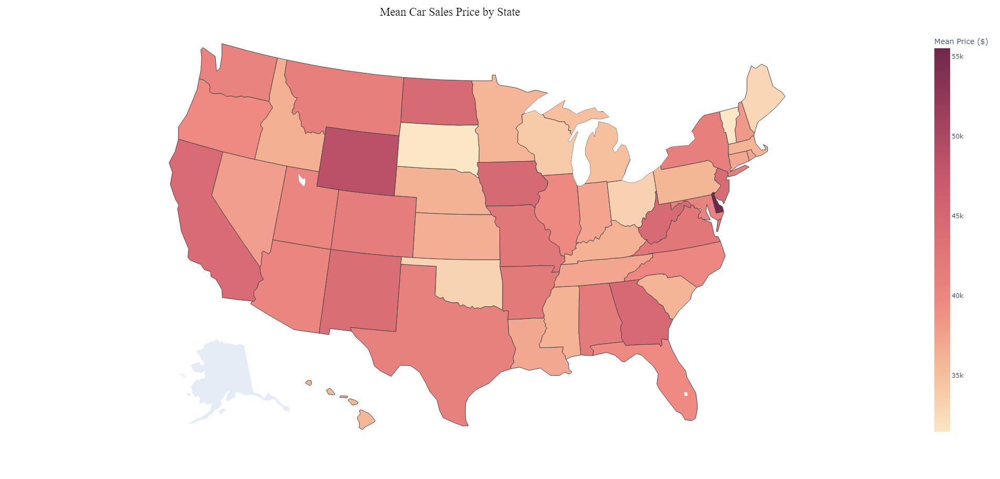
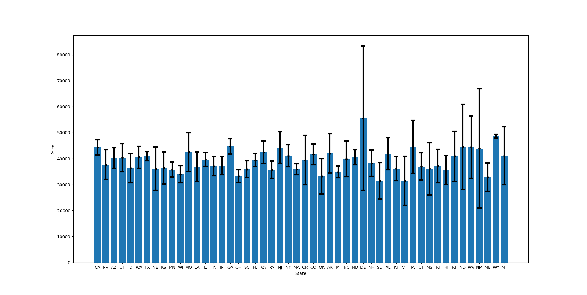

# Using Confidence Intervals to Approximate the True Average Sales Price of All Cars in Every State

## The Problem

We would like to be able to compare the overall sales prices of cars between states to determine if one state has a cheaper offering of cars than another. We can use the mean sales prices of cars in each state to do this. Given this dataset, however, we have less than 10,000 entries of car sales information to calculate these state averages. This means that averages calculated from only this data would not truly represent all car sales prices per state. 

To solve this issue, we can calculate confidence intervals with the given information to gain a better grasp of the true mean sales prices of all cars in each state in the U.S. - the average we would receive if every single car sale in a state was recorded and combined to gain this value. Realistically, this would not be possible due to sampling variability and other factors, so this method is just an estimate. Additionally, certain considerations and assumptions must be made for this method which will be addressed at the end.

I only used Python for this project.

## The Process

1. First, I cleaned up the data. I converted the given CSV format to a Pandas DataFrame. Since I mainly used the `State` and `Price` values, I focused on these two pieces of information in the dataset when cleaning. `State` contained the abbreviation for the U.S. state where the car sale occurred, but the data set also contained abbreviations for territories or other areas that were not U.S. states. Since every U.S. state is a two-letter abbreviation, I removed entries whose `State` value was not two characters long. I verified that 50 unique entries for `State` were now left in the dataset.

2. Next, I cleaned the `Price` values. Since a mean price needed to be calculated, the String values needed to be converted to Integers. I removed the initial `$` character as well as any `,` characters. Then, the remaining String was converted to an Integer value. I used the Regular Expression module to make this easier.

3. With the dataset now ready to be used, I started by sorting the dataset entries by the state they belonged to. I then calculated the mean for each state using NumPy. As a visual representation of this, I used the Plotly module to create a graphic map of this information:

&nbsp;&nbsp;&nbsp;&nbsp;&nbsp;&nbsp;&nbsp;&nbsp;&nbsp;&nbsp;&nbsp;Although it looks appealing, this only represents the data we were given. That's good, but we can do better!

4. In order to calculate confidence intervals, the standard deviation for all of the values in each state is needed alongside their mean. Thus, the standard deviation of car sales prices was also calculated for every state using NumPy. 

5. Before we can calculate the confidence intervals, there is one last thing we must consider - the degrees of freedom for each set of values. Sets with 0 degrees of freedom (states that only had one entry) cannot have a confidence interval calculated, so they were excluded with not enough information provided as reasoning.

6. With all of this information, a 90% confidence interval for each state was calculated using the following formula:

$$ CI = {\bar{x} \pm z{s \over \sqrt{n}}} $$

7. I lastly generated a visualization with this newfound information and the Matplotlib module:

## Significance

We can perform as much data manipulation and calculation as we want but it is useless if we don't understand what our results mean. Our final bar chart displays a range of possible prices for each state in which the true mean value of all car sales prices for that state resides. In other words, our 90% confidence interval means that we are 90% sure that the true average car sales price consisting of every car sale in a state is within the interval displayed for each bar on the chart. Some intervals are larger due to a lower sample size for that state and some are more accurate due to a greater sample size. With this knowledge, we can more confidently compare whether there is a significant difference between the averages of any two states' car sale prices. If two intervals do not overlap prices at all, there is a statistically significant difference between their true averages. We now have a much more representative set of information than simple means can display.

## Considerations

Although our analysis was very beneficial and informative, it only uses this one data set. If this data is biased in any way, the information could be skewed or misleading. Our model assumes the data was collected randomly across the United States. If these statements do not hold true, our method loses credibility which should be kept in mind.